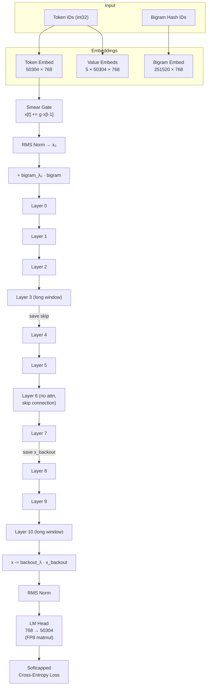
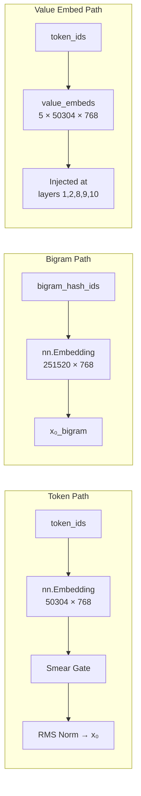
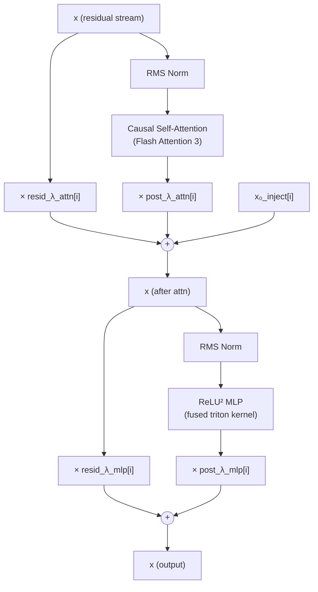
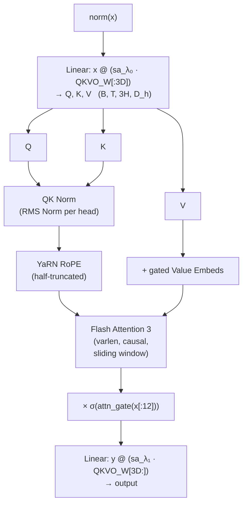
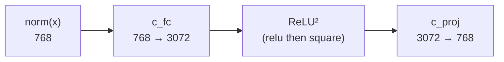
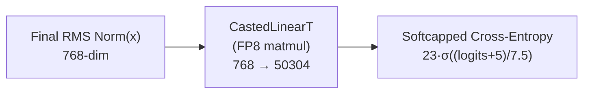
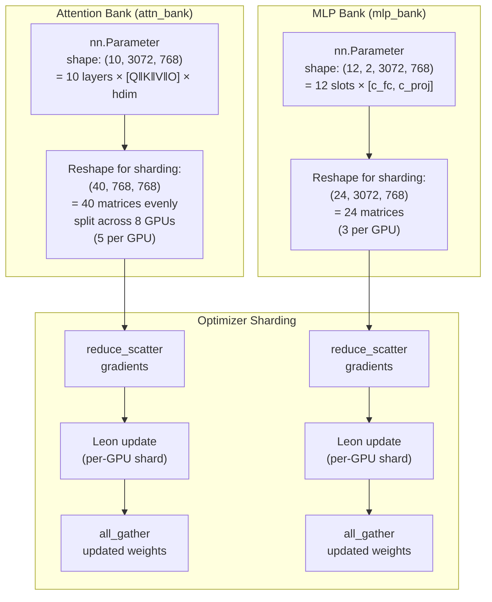
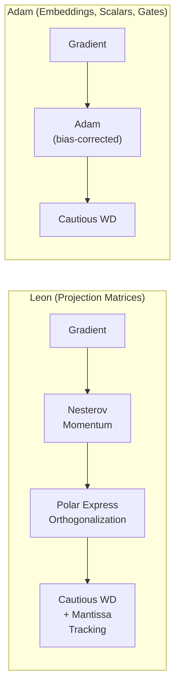
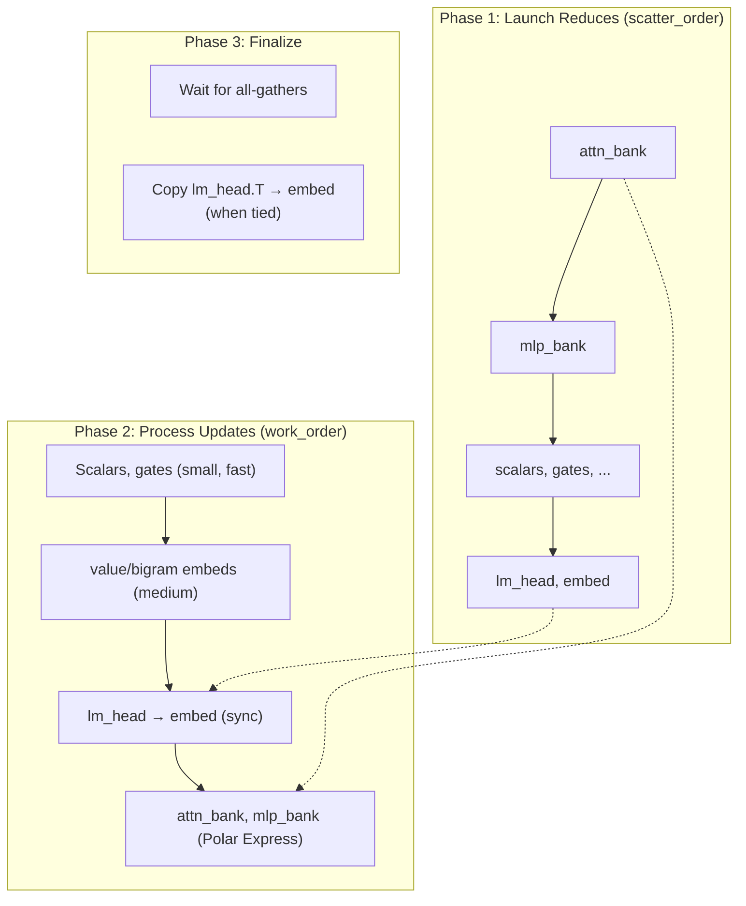

# NanoGPT Architecture — `train_gpt_leon.py`

A detailed guide to the model, optimizer, and training pipeline used in [train_gpt_leon.py](file:///mnt/nas/rj23424/modded-nanogpt/train_gpt_leon.py).

---

## Table of Contents

1. [Model Overview](#model-overview)
2. [High-Level Data Flow](#high-level-data-flow)
3. [Embedding & Input Preparation](#embedding--input-preparation)
4. [Transformer Block Architecture](#transformer-block-architecture)
5. [Causal Self-Attention](#causal-self-attention)
6. [MLP — Fused ReLU² GLU](#mlp--fused-relu²-glu)
7. [Output Head & Softcapped Loss](#output-head--softcapped-loss)
8. [Parameter Banking & Sharding](#parameter-banking--sharding)
9. [Optimizer: LeonAndAdam](#optimizer-leonandadam)
10. [Training Schedule](#training-schedule)
11. [Summary of Key Hyperparameters](#summary-of-key-hyperparameters)

---

## Model Overview

The model is a **decoder-only GPT** with 11 transformer layers, 6 attention heads, 128-dim heads (768 model dim), and a vocabulary of 50,304 tokens. It is designed for high-throughput distributed training on 8 GPUs.

| Parameter         | Value   |
|-------------------|---------|
| `vocab_size`      | 50,304  |
| `num_layers`      | 11      |
| `num_heads`       | 6       |
| `head_dim`        | 128     |
| `model_dim`       | 768     |
| `mlp_hidden_dim`  | 3,072 (4× model_dim) |
| Precision         | bfloat16 (FP8 matmuls for lm_head) |

> Source: [GPT.__init__](file:///mnt/nas/rj23424/modded-nanogpt/train_gpt_leon.py#L1128-L1227) and [model instantiation](file:///mnt/nas/rj23424/modded-nanogpt/train_gpt_leon.py#L1851-L1858)

---

## High-Level Data Flow



---

## Embedding & Input Preparation

Three embedding streams feed into the model:



### Smear Gate
A gated forward-smear shifts information from token `t-1` into token `t`:
```
x[t] = x[t] + σ(smear_gate(x[t, :12])) · smear_λ · x[t-1]
```
> Source: [forward, L1273-L1276](file:///mnt/nas/rj23424/modded-nanogpt/train_gpt_leon.py#L1273-L1276)

### x₀ and Bigram Injection
Each layer receives a residual injection from the original normalized embedding `x₀` and from the bigram embedding, controlled by per-layer learned scalars `x0_lambdas` and `bigram_lambdas`:
```
inject[i] = x₀ · x0_λ[i] + x₀_bigram · bigram_λ[i]
```
> Source: [forward, L1281-L1283](file:///mnt/nas/rj23424/modded-nanogpt/train_gpt_leon.py#L1281-L1283)

---

## Transformer Block Architecture

Each of the 11 layers follows this pattern (with exceptions noted below):



### Residual Scaling
Both sub-layers scale the residual stream and the sub-layer output independently:
```python
x = resid_λ_attn[i] * x + post_λ_attn[i] * attn_out + x0_inject[i]
x = resid_λ_mlp[i]  * x + post_λ_mlp[i]  * mlp_out
```
All `resid_lambdas` are initialized to `√1.1` such that the per-layer cumulative scaling is `1.1`.

> Source: [forward loop, L1289-L1317](file:///mnt/nas/rj23424/modded-nanogpt/train_gpt_leon.py#L1289-L1317)

### Special Layer Behavior

| Layer | Behavior |
|-------|----------|
| 0, 2, 5, 9 | **Paired-head** attention (adjacent heads attend to each other's keys) |
| 3 | Long window attention; **skip connection saved** |
| 6 | **No attention** — uses skip connection from layer 3 instead: `x += skip_gate · skip_connection` |
| 7 | **Backout reference saved** (`x_backout = x`) — used after layer 10 |
| 10 | Long window attention |

After the final layer:
```python
x -= backout_λ · x_backout    # remove contributions from first 7 layers
x = RMSNorm(x)
```

> Source: [L1310-L1324](file:///mnt/nas/rj23424/modded-nanogpt/train_gpt_leon.py#L1310-L1324)

---

## Causal Self-Attention



### Key Details

- **QK-Norm**: Both Q and K are RMS-normalized before RoPE — stabilizes training.
- **Half-Truncated RoPE via YaRN**: The bottom half of head dimensions uses learned rotary frequencies; the top half is zeroed out. YaRN applies interpolation when the window size changes.
- **Key Offset**: For long-window layers, the stationary (non-rotated) portion of keys is shifted forward by 1 position, enabling 1-layer induction heads.
- **Value Embedding Injection**: At layers 1, 2, 8, 9, 10, value embeddings are gated and added to V: `v += 2σ(ve_gate(x[:6] ‖ ve[:6])) · ve`
- **Attention Gating**: Output is element-wise gated: `y *= σ(attn_gate(x[:12]))` — enables context-based no-op.
- **Sliding Window**: Controlled per-layer; short (128–768 tokens) or long (384–2560 tokens) windows.
- **Flash Attention 3**: Uses `flash_attn_varlen_func` for variable-length packed sequences.

### Paired-Head Attention (Layers 0, 2, 5, 9)
Adjacent heads' queries attend to each other's keys by interleaving two copies of the input stream, doubling sequence length and halving effective window size.

> Source: [CausalSelfAttention, L1042-L1112](file:///mnt/nas/rj23424/modded-nanogpt/train_gpt_leon.py#L1042-L1112)

---

## MLP — Fused ReLU² GLU



- Uses a **fused Triton kernel** (`FusedLinearReLUSquareFunction`) that computes `relu(x @ W1.T)² @ W2.T` in a single pass.
- ReLU² activation from [Primer paper](https://arxiv.org/abs/2109.08668v2): claimed ~1-2% better than GELU.
- `c_fc` weights are initialized with uniform sampling; `c_proj` weights are zero-initialized.

> Source: [ReLUSqrdMLP usage, L1317](file:///mnt/nas/rj23424/modded-nanogpt/train_gpt_leon.py#L1317), [triton_kernels.py](file:///mnt/nas/rj23424/modded-nanogpt/triton_kernels.py)

---

## Output Head & Softcapped Loss



- **`CastedLinearT`**: Stores weights in transposed layout `(in, out)` for faster gradient accumulation. Uses FP8 matmul during training.
- **Softcapping**: Inspired by Gemma 2 — logits are passed through `23 · σ((logits + 5) / 7.5)` before cross-entropy, bounding the loss landscape.
- **Weight tying**: `embed.weight ≡ lm_head.weight.T` for the first 2/3 of training. At step `split_step`, they are untied and the optimizer state is transferred.

> Source: [CastedLinearT, L927-L954](file:///mnt/nas/rj23424/modded-nanogpt/train_gpt_leon.py#L927-L954), [forward head, L1326-L1335](file:///mnt/nas/rj23424/modded-nanogpt/train_gpt_leon.py#L1326-L1335)

---

## Parameter Banking & Sharding

Instead of per-layer `nn.Linear` modules, weights are stored in **parameter banks** — single tensors containing all layers' weights. This enables efficient sharded optimization across GPUs.



### Bank Layout

| Bank | Shape | Sharded Shape | Per-GPU | Contents |
|------|-------|---------------|---------|----------|
| `attn_bank` | (10, 3072, 768) | (40, 768, 768) | 5 matrices | QKVO weights for 10 attn layers |
| `mlp_bank` | (12, 2, 3072, 768) | (24, 3072, 768) | 3 matrices | c_fc + c_proj for 11 MLP layers + 1 padding |

> **Why 12 MLP slots?** 11 layers + 1 padding slot to make 24 matrices (divisible by 8 GPUs).
>
> **Why 10 attention layers?** Layer 6 has no attention (uses skip connection).

> Source: [Parameter banks, L1150-L1186](file:///mnt/nas/rj23424/modded-nanogpt/train_gpt_leon.py#L1150-L1186)

### Communication Modes

| Mode               | Mechanism                          | Used By |
|--------------------|------------------------------------|---------|
| `replicated`       | all-reduce gradients               | Scalars, gates, lambdas |
| `sharded`          | reduce-scatter → update → all-gather | attn_bank, mlp_bank, lm_head, embed, value_embeds |
| `sharded_sparse`   | Sparse all-to-all (only touched rows) | bigram_embed (when `world_size=8`) |

> Source: [ParamConfig, L342-L361](file:///mnt/nas/rj23424/modded-nanogpt/train_gpt_leon.py#L342-L361), [param_table, L1657-L1673](file:///mnt/nas/rj23424/modded-nanogpt/train_gpt_leon.py#L1657-L1673)

---

## Optimizer: LeonAndAdam

Two optimizers are combined, with explicit communication scheduling (no backward hooks):



### Leon (for `attn_bank`, `mlp_bank`)
1. **Nesterov Momentum**: `g = lerp(grad, momentum_buffer, momentum)`
2. **Augmented Polar Express**: Orthogonalizes `g` using `(GGᵀ + L)^{-1/2} G` where `L` is an EMA of the Gram matrix (second momentum)
3. **Cautious Weight Decay**: Only decays weights where `sign(update) == sign(weight)`
4. **Mantissa Tracking**: Stores the lower 16 bits of FP32 to accumulate sub-bfloat16 precision updates

### Adam (for embeddings, scalars, gates)
- Standard Adam with per-parameter `(β₁, β₂)` and bias correction
- **Cautious weight decay**: Same gating as Leon
- **Only stepped on odd training steps** (halves compute for these small params)

### Optimizer Step Ordering



> Source: [LeonAndAdam, L364-L917](file:///mnt/nas/rj23424/modded-nanogpt/train_gpt_leon.py#L364-L917), [Polar Express, L160-L245](file:///mnt/nas/rj23424/modded-nanogpt/train_gpt_leon.py#L160-L245)

---

## Training Schedule

Training proceeds through 3 stages (+ extension), progressively increasing batch size, window sizes, and sequence length while reducing multi-token prediction targets:

```mermaid
gantt
    title Training Schedule (1490 total steps)
    dateFormat X
    axisFormat %s

    section Batch Size
    8×2048×8    :a1, 0, 483
    16×2048×8   :a2, 483, 967
    24×2048×8   :a3, 967, 1490

    section Window Sizes
    short=1, long=3  :b1, 0, 483
    short=3, long=7  :b2, 483, 967
    short=5, long=11 :b3, 967, 1450
    short=6, long=13→20 :b4, 1450, 1490

    section MTP Targets
    3-token (1.0, 0.5, 0.25→0)  :c1, 0, 483
    2-token (1.0, 0.5→0)        :c2, 483, 967
    1-token (1.0)               :c3, 967, 1490

    section Seq Length
    896   :d1, 0, 483
    2048  :d2, 483, 1490

    section Embed/LM Head
    Tied          :e1, 0, 967
    Untied        :e2, 967, 1490
```



### LR and Momentum Schedule

| Schedule | Warmup | Steady | Cooldown |
|----------|--------|--------|----------|
| **Leon LR** | Tied to batch size (`lr_mul`) | Stage-dependent | Last 60%: linear decay to 15% |
| **Momentum** | 300 steps: 0.85 → 0.95 | 0.95 | Last 50 steps: 0.95 → 0.85 |
| **Adam** | Same LR schedule | Updated every other step | Same cooldown |

> Source: [TrainingSchedule, L1554-L1623](file:///mnt/nas/rj23424/modded-nanogpt/train_gpt_leon.py#L1554-L1623), [get_muon_momentum, L1626-L1638](file:///mnt/nas/rj23424/modded-nanogpt/train_gpt_leon.py#L1626-L1638)

---

## Summary of Key Hyperparameters

### Leon Defaults
| Parameter | Value |
|-----------|-------|
| Learning Rate | 0.046 |
| Momentum | 0.95 (warmup/cooldown) |
| Weight Decay | 0.6 |
| β₂ (Gram EMA) | 0.8 |

### Adam Defaults
| Parameter | Value |
|-----------|-------|
| Learning Rate | 0.008 |
| ε | 1e-10 |
| Weight Decay | 0.005 |

### Notable Per-Parameter Overrides
| Parameter | Key Override |
|-----------|-------------|
| `lm_head` | β₁=0.5, β₂=0.95, wd_mul=150× |
| `bigram_embed` | β₁=0.75, lr_mul=75×, wd_mul=5× |
| `value_embeds` | β₁=0.75, lr_mul=75×, wd_mul=5× |
| `scalars` | lr_mul=5×, no weight decay |
| `mlp_bank` c_proj | 2× LR multiplier (per-matrix) |

> Source: [param_table, L1657-L1673](file:///mnt/nas/rj23424/modded-nanogpt/train_gpt_leon.py#L1657-L1673), [defaults, L1684-L1695](file:///mnt/nas/rj23424/modded-nanogpt/train_gpt_leon.py#L1684-L1695)
