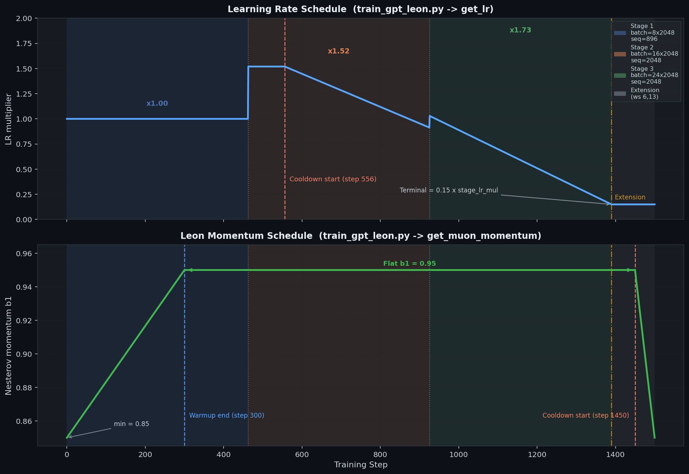
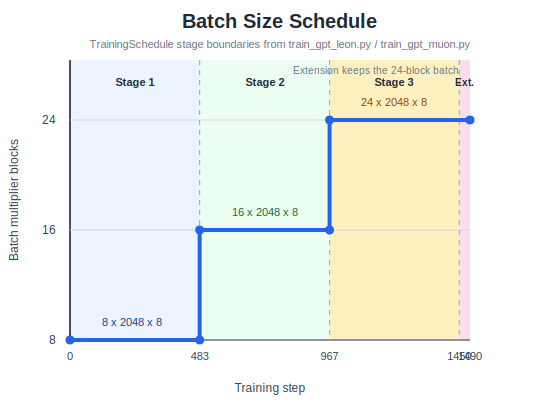

# Muon / Leon Optimizer Implementation Details

This document outlines the specialized architectural choices and hyperparameters driving the optimizers in `train_gpt_muon.py` and `train_gpt_leon.py`.
Sections 7 and 8 (below) cover the LR and momentum schedules specific to **`train_gpt_leon.py`**.

## 1. Application Scope (Muon vs. Adam)

*(Defined in param table: [train_gpt_muon.py:L1646-L1662](file:///mnt/nas/rj23424/modded-nanogpt/train_gpt_muon.py#L1646-L1662))*

- **Muon**: Applied exclusively to the large 2D projection matrices (`attn_bank` and `mlp_bank`). Muon is designed specifically to constrain matrix transformations dynamically through orthogonalization without affecting their spectral scales.
- **Adam**: Applied to all remaining parameters, including dense 1D vectors (embeddings, router gate weights, and scalar multipliers).

## 2. Core Hyperparameters for Muon

*(Configuration dict: [train_gpt_muon.py:L1679-L1683](file:///mnt/nas/rj23424/modded-nanogpt/train_gpt_muon.py#L1679-L1683))*
The primary mathematical properties of the Muon update step are driven by three main hyperparameter parameters defined inside `muon_defaults`:

- **`lr: 0.023`**
  - The learning rate step size. Exceptionally large compared to standard Adam learning rates, making it heavily sample-efficient.
- **`momentum: 0.95`**
  - Standard Nesterov SGD momentum tracking coefficient. Gradients are accumulated into this buffer prior to passing through the Polar Express algorithm.
- **`weight_decay: 1.2`**
  - A massive parameter penalty utilized exclusively via a *Cautious Weight Decay* mask. Weight decay is artificially bypassed whenever it directly opposes a parameter's gradient update. This massive parameter gravity anchors the network space and reliably suppresses training divergence over time.

## 3. Aspect-Ratio Scaling

*(Scaling logic: [train_gpt_muon.py:L501-L502](file:///mnt/nas/rj23424/modded-nanogpt/train_gpt_muon.py#L501-L502))*
Muon handles structurally different matrices automatically by observing the aspect ratio of the underlying dense parameter chunk:

- Calculated automatically as: `max(1.0, rows/columns) ** 0.5`
- This dynamic multiplier natively bolsters the learning rate on "taller" matrices, creating aligned convergence curves across diverse weight classes without extensive custom tuning.

## 4. Alternating MLP Projections (`c_proj` Scaling)

*(Setup logic: [train_gpt_muon.py:L507-L513](file:///mnt/nas/rj23424/modded-nanogpt/train_gpt_muon.py#L507-L513), Application: [train_gpt_muon.py:L871-L873](file:///mnt/nas/rj23424/modded-nanogpt/train_gpt_muon.py#L871-L873))*
Feed-forward network projections (`c_fc` expanding, `c_proj` compressing) perform separate geometrical manipulations and require independent constraints to learn optimally.

- In `train_gpt_muon.py`, the `mlp_bank` array targets individual matrices via sequential index checks (`mat_idx % 2 == 1`).
- All mapped down-projections (`c_proj`) natively receive a **2.0x learning rate multiplier**.
- This enables the dense compression sweeps of the MLP blocks to scale exactly twice as forcefully as the preceding up-projections, which accelerates baseline feature generation drastically.

## 5. Learning Rate Scheduler

*(Schedule lookup logic: [train_gpt_muon.py:L1588-L1596](file:///mnt/nas/rj23424/modded-nanogpt/train_gpt_muon.py#L1588-L1596))*
The overall learning rate schedule (`get_lr(step)`) evaluates custom step schedules decoupled from typical PyTorch generic schedulers. It is directly coupled to the model's dynamic batch size curriculum defined in `TRAINING_STAGES`:

- **Step-wise Batch Scaling**: As the batch sizes artificially step up across stages (e.g., from `8` to `16` to `24` blocks), the global learning rate multiplier steps up proportionally via fractional power rules (e.g., `(16/8)**0.6 -> 1.52x LR`).
- **Linear Cooldown**: A simple linear cooldown phase is enforced over the trailing `60%` of scheduled iterations (`cooldown_frac=0.60`). During this duration, the learning rate linear decays downwards to a terminal fraction of `0.15` by the final training step to ensure smooth convergence.

## 6. Parameter Bank Shapes and Sharding

*(Bank instantiation: [train_gpt_muon.py:L1154-L1160](file:///mnt/nas/rj23424/modded-nanogpt/train_gpt_muon.py#L1154-L1160))*
To optimize distributed gradient communication and efficiently accelerate the Polar Express calculation, Muon groups independent parameters into contiguous blocks called "banks". By analyzing the script, we document the specific bank sharding sizes driving the efficiency.

- **`attn_bank`**: Instantiated with shape `(10, 3072, 768)` where `10` is the number of attention layers and `3072` embeds 4 individual queries of standard model dimension `768`. Before reducing scattered gradients over the network, it is reshaped strictly to `(40, 768, 768)`. This flattens the chunk allocations so that it cleanly shards along the leading dimension into 40 distinct square blocks, which perfectly divides by the parallel processing size of `8` GPUs (allowing 5 full chunk operations per rank).
- **`mlp_bank`**: Instantiated natively with shape `(12, 2, 3072, 768)` mapping to 12 feed-forward layers, 2 projections (`c_fc` expanding layer, and `c_proj` contracting layer), a raw hidden dimension of `3072` and input model dimension of `768`. This is algorithmically reshaped onto a flat scale of `(24, 3072, 768)`, cleanly slicing standard bounds along the number of overall matrices (24 total matrices). This enables each of the 8 participating GPUs to cleanly and independently update exactly 3 dense rectangle matrices per iteration without requiring any ragged padded bounds.

### Gradients and Orthogonalization Reshaping

The architecture parameters are inherently 3-dimensional. To seamlessly feed the gradients into the `polar_express` optimization logic (which expects sequences of 2D matrices), the gradient tracking layer dynamically reshapes and slices them prior to application:

1. **Dimension Parsing**: During optimizer initialization in `_build_param_cfg` ([train_gpt_muon.py:L491-L499](file:///mnt/nas/rj23424/modded-nanogpt/train_gpt_muon.py#L491-L499)), the optimizer reads the defined `.reshape` attribute. It statically calculates a `chunk_shape` per GPU partition (e.g. `(5, 768, 768)` for the `attn_bank` on an 8-GPU scale).
2. **Gradient Flattening**: Given that backpropagation creates gradients mirroring the `(num_layers, inner_dims, outer_dims)` model shape, `_launch_reduce` uses `grad_reshaped = grad.view(p_cfg.reshape)` ([train_gpt_muon.py:L583](file:///mnt/nas/rj23424/modded-nanogpt/train_gpt_muon.py#L583)) to reshape the complex gradient arrays into the flat sequence of matrices format during the gradient syncing process.
3. **Polar Express Processing**: In `_muon_update` ([train_gpt_muon.py:L861-L864](file:///mnt/nas/rj23424/modded-nanogpt/train_gpt_muon.py#L861-L864)), the effectively sliced gradients are fed into `polar_express` as `v_chunk`. Because `chunk_shape[-2]` (the middle dimension) operates natively as the effective matrix row-count constraint, these contiguous 3D arrays represent an exact batched sequence of 2D matrices. This sequence gracefully utilizes `torch.baddbmm` within the Polar Express procedure to perform orthogonalization sweeps cleanly in parallel.

---

## 7. Learning Rate Schedule (`train_gpt_leon.py`)

*(Schedule definition: [train_gpt_leon.py:L1599-L1623](file:///mnt/nas/rj23424/modded-nanogpt/train_gpt_leon.py#L1599-L1623))*

The LR schedule in `train_gpt_leon.py` is controlled by `TrainingSchedule.get_lr(step)`, which ties the LR multiplier to the batch-size curriculum defined in `TRAINING_STAGES`.

### 7.1 Stage-wise LR multipliers

Each training stage raises the global LR proportionally to the increased batch size (a power-law scaling rule):

| Stage | Steps (approx) | Batch size | Seq len | LR multiplier | Derivation |
|-------|---------------|------------|---------|---------------|------------|
| Stage 1 | 0 – 463 | 8 × 2048 | 896 | **×1.00** | baseline |
| Stage 2 | 464 – 926 | 16 × 2048 | 2048 | **×1.52** | `(16/8)^0.6 ≈ 1.52` |
| Stage 3 | 927 – 1390 | 24 × 2048 | 2048 | **×1.73** | `(24/8)^0.5 ≈ 1.73` |
| Extension | 1391 – 1500 | 24 × 2048 | 2048 | *(unused/1.0)* | window 6,13 only |

### 7.2 Linear Cooldown

A **linear cooldown** is applied over the trailing **60 %** of `scheduled_iterations` (i.e., from step ≈ 556 to step 1390). During cooldown the effective multiplier linearly interpolates to **15 %** of the current stage's LR multiplier:

```python
cd_start = int(scheduled_iterations * (1 - cooldown_frac))  # cooldown_frac = 0.60
t = min(1.0, (step - cd_start) / (scheduled_iterations - cd_start))
lr = stage_lr_mul * (1 - t) + 0.15 * t
```

The final LR is applied by scaling each parameter's `initial_lr` at every optimizer step:

```python
p_cfg.lr = p_cfg.initial_lr * step_lr   # step_lr = get_lr(step)
```

### 7.3 Leon defaults (base LR before multiplier)

*(Config dict: [train_gpt_leon.py:L1690-L1694](file:///mnt/nas/rj23424/modded-nanogpt/train_gpt_leon.py#L1690-L1694))*

```python
leon_defaults = dict(
    lr           = float(os.environ.get("LEON_LR",   "0.046")),
    momentum     = 0.95,
    weight_decay = float(os.environ.get("LEON_WD",   "0.6")),
    beta2        = float(os.environ.get("LEON_BETA2", "0.8")),
)
```

- **`lr = 0.046`** (env-overridable): base Leon learning rate, higher than typical Muon `0.023` to account for the second-momentum dampening from the Gram matrix.
- **`beta2 = 0.8`**: EMA decay for the second-momentum (Gram matrix) buffer inside `polar_express`. A lower β₂ means the Gram matrix tracks shorter history, responding faster to gradient changes.
- **`weight_decay = 0.6`**: Applied as [cautious weight decay](https://arxiv.org/abs/2411.16085) — gated by sign-alignment between gradient and parameter so it never actively opposes the update direction.

---

## 8. Momentum Schedule (`train_gpt_leon.py`)

*(Schedule function: [train_gpt_leon.py:L1626-L1638](file:///mnt/nas/rj23424/modded-nanogpt/train_gpt_leon.py#L1626-L1638))*

The Nesterov momentum coefficient β₁ is **not fixed** — it follows a three-phase schedule via `get_muon_momentum(step)`:

```python
def get_muon_momentum(step, muon_warmup_steps=300, muon_cooldown_steps=50,
                      momentum_min=0.85, momentum_max=0.95):
    momentum_cd_start = training_schedule.total_steps - muon_cooldown_steps
    if step < muon_warmup_steps:                   # Phase 1: Linear warmup
        frac = step / muon_warmup_steps
        momentum = momentum_min + frac * (momentum_max - momentum_min)
    elif step > momentum_cd_start:                 # Phase 3: Linear cooldown
        frac = (step - momentum_cd_start) / muon_cooldown_steps
        momentum = momentum_max - frac * (momentum_max - momentum_min)
    else:                                          # Phase 2: Flat
        momentum = momentum_max
    return momentum
```

| Phase | Steps | Behaviour | β₁ range |
|-------|-------|-----------|----------|
| **Warmup** | 0 → 300 | Linear increase | 0.85 → 0.95 |
| **Flat** | 300 → 1450 | Constant | 0.95 |
| **Cooldown** | 1450 → 1500 | Linear decrease | 0.95 → 0.85 |

**Rationale:** Starting with lower momentum prevents the EMA buffer from over-committing to very noisy early gradients. The brief cooldown at the end mirrors the LR decay and prevents the heavy momentum buffer from carrying stale history into the final convergence phase.

This schedule is applied inside `step_optimizers` by writing into `p_cfg.momentum` before every optimizer step:

```python
if p_cfg.optim == "leon":
    p_cfg.momentum = muon_momentum   # overrides the static default at each step
```

---

## 9. Combined Schedule Visualization

The left chart overlays the LR and momentum schedules across the full training run (`1450` scheduled + `40` extension steps). The right chart makes the batch-size curriculum explicit using the exact `TrainingSchedule` stage boundaries (`0-483`, `483-967`, `967-1450`, `1450-1490`).

<table>
  <tr>
    <td width="68%">
      
    </td>
    <td width="32%">
      
    </td>
  </tr>
  <tr>
    <td align="center"><em>Learning-rate and momentum schedules</em></td>
    <td align="center"><em>Batch-size curriculum</em></td>
  </tr>
</table>

---

## 10. Augmented Polar Express Algorithm (Leon Core)

*(Function: [train_gpt_leon.py:L170-L245](file:///mnt/nas/rj23424/modded-nanogpt/train_gpt_leon.py#L170-L245))*

Leon replaces the standard Newton-Schulz orthogonalization used in Muon with an **Augmented Polar Express** iteration. The key idea: instead of orthogonalizing the gradient alone, Leon augments the Gram matrix with a second-momentum estimate to produce a damped, preconditioned update Direction.

### 10.1 Mathematical formulation

Given a gradient chunk **G** and a second-momentum buffer **L** (Gram matrix EMA), the algorithm computes:

$$(\mathbf{G}\mathbf{G}^\top + \mathbf{L})^{-1/2}\,\mathbf{G}$$

This is equivalent to the standard polar decomposition but with the additional **L** term acting as a spectral damper — it prevents small singular values from being over-amplified during orthogonalization.

### 10.2 Orientation-aware computation

*(Tall/wide branching: [train_gpt_leon.py:L184-L191](file:///mnt/nas/rj23424/modded-nanogpt/train_gpt_leon.py#L184-L191))*

The Gram matrix is computed on the **smaller side** of the matrix to minimize memory and compute:

```python
if is_tall:       # rows >= cols → GᵀG is (cols × cols) — smaller
    gram_tmp = grad_chunk.mT @ grad_chunk
else:             # cols ≥ rows → GGᵀ is (rows × rows) — smaller
    gram_tmp = grad_chunk @ grad_chunk.mT
```

This choice propagates through the entire iteration: when `is_tall`, the auxiliary matrix **A** is right-multiplied onto **X**; otherwise it is left-multiplied ([L234-L237](file:///mnt/nas/rj23424/modded-nanogpt/train_gpt_leon.py#L234-L237)).

### 10.3 Trace normalization

*(Normalization: [train_gpt_leon.py:L200-L209](file:///mnt/nas/rj23424/modded-nanogpt/train_gpt_leon.py#L200-L209))*

Before iterating, both **X** (the Nesterov gradient) and **A** (the initial augmented Gram) are scaled so that tr(**GGᵀ** + **L**) ≈ 1. A **1.1² safety cushion** is applied to the trace to keep the iteration within its convergence basin:

```python
tr = X.float().pow(2).sum(dim=(-2,-1), keepdim=True) \
   + A.diagonal(dim1=-2, dim2=-1).sum(dim=-1, keepdim=True).unsqueeze(-1)
tr = tr.clamp_min(1e-12) * (1.1**2)
```

### 10.4 Iteration coefficients

*(Coefficients: [train_gpt_leon.py:L161-L167](file:///mnt/nas/rj23424/modded-nanogpt/train_gpt_leon.py#L161-L167))*

The iteration uses 5 pre-computed `(a, b, c)` coefficient triples. Each step updates both **X** and **A** simultaneously:

```python
for a, b, c in polar_express_coeffs:
    B = b * A + c * (A @ A)         # auxiliary update matrix
    X = a * X + (X @ B)             # update X (right-multiply for tall)
    # Symmetric A update: A ← (aI + B) A (aI + B)
    BA = B @ A
    A = a * A + BA
    A = a * A + A @ B
```

The coefficients are pre-computed for `num_iters=5`, `safety_factor=2e-2`, `cushion=2`, ensuring stable convergence in bfloat16.

---

## 11. Second Momentum — Gram Matrix EMA

*(EMA update: [train_gpt_leon.py:L186-L192](file:///mnt/nas/rj23424/modded-nanogpt/train_gpt_leon.py#L186-L192))*

Leon introduces a **second-momentum buffer** that tracks an exponential moving average of the gradient's Gram matrix. This is the key difference from standard Muon.

### 11.1 Buffer initialization

*(Buffer creation: [train_gpt_leon.py:L555-L560](file:///mnt/nas/rj23424/modded-nanogpt/train_gpt_leon.py#L555-L560))*

The second-momentum buffer is sized as `(chunk_size, min_D, min_D)` — always the **smaller** of the two matrix dimensions squared. For the `attn_bank` (768 × 768 chunks), this is `(5, 768, 768)` per rank. For `mlp_bank` (3072 × 768), this is `(3, 768, 768)` per rank:

```python
D1, D2 = chunk_shape[-2], chunk_shape[-1]
min_D = min(D1, D2)
second_momentum_buffer = torch.zeros(
    (p_cfg.chunk_size, min_D, min_D), dtype=torch.float32, device=param.device
)
```

### 11.2 EMA update rule

The Gram matrix buffer is updated every step with decay factor **β₂ = 0.8**:

```python
second_momentum_buffer.lerp_(gram_tmp, 1 - beta2)
```

A lower β₂ means the Gram matrix responds faster to gradient distribution changes. Symmetry is explicitly enforced with `A = 0.5 * (A + A.mT)` before the iteration ([L198](file:///mnt/nas/rj23424/modded-nanogpt/train_gpt_leon.py#L198)).

---

## 12. Mantissa Precision Tracking

*(Update logic: [train_gpt_leon.py:L898-L916](file:///mnt/nas/rj23424/modded-nanogpt/train_gpt_leon.py#L898-L916))*

Leon parameters are stored in bfloat16 (7 mantissa bits) but updated with **effective FP32 precision** via mantissa tracking. This avoids the precision loss of casting back and forth.

### 12.1 How it works

A separate `uint16` mantissa buffer stores the **lower 16 bits** of the FP32 representation. The bfloat16 parameter stores the upper 16 bits. Combined, they reconstruct a full FP32 value:

```python
# Reconstruct FP32 from bf16 upper bits + mantissa lower bits
p_precise_raw = (p.to(torch.uint32) << 16) | mantissa.to(torch.uint32)
p_precise = p_precise_raw.view(torch.float32)

# Apply update in FP32 precision...
p_precise.copy_(p_precise - (p_precise * mask * wd * lr) - (grad * lr))

# Split back into bf16 + mantissa
p.copy_((p_precise_raw >> 16).to(torch.uint16))
mantissa.copy_(p_precise_raw.to(torch.uint16))
```

This ensures that small updates (common during cooldown) are not quantized away by bfloat16's limited precision, while keeping the actual parameter tensor in bfloat16 for memory efficiency and fast forward/backward passes.

### 12.2 Buffer initialization

*(Buffer creation: [train_gpt_leon.py:L563-L565](file:///mnt/nas/rj23424/modded-nanogpt/train_gpt_leon.py#L563-L565))*

The mantissa buffer is zero-initialized with shape matching the momentum buffer (one per chunk), stored as `torch.uint16`.

---

## 13. Cautious Weight Decay

*(Compiled kernel: [train_gpt_leon.py:L898-L916](file:///mnt/nas/rj23424/modded-nanogpt/train_gpt_leon.py#L898-L916))*

Both Leon and Adam use **cautious weight decay** — a gated version of decoupled weight decay from [Liang et al. (2024)](https://arxiv.org/abs/2411.16085). The weight decay is only applied when the gradient and parameter are **sign-aligned**:

```python
mask = (grad * p_precise) >= 0
p_precise.copy_(p_precise - (p_precise * mask * wd_factor * lr_factor) - (grad * lr_factor))
```

When `grad` and `p` have opposite signs, the mask is 0 and weight decay is skipped. This prevents the penalty from fighting the gradient update, which is particularly important given Leon's high weight decay coefficient of **0.6** (vs. Muon's 1.2 at a lower base LR).

**Adam's cautious weight decay** ([L849-L852](file:///mnt/nas/rj23424/modded-nanogpt/train_gpt_leon.py#L849-L852)) uses the same gating principle but operates on the Adam update rather than the raw gradient:

```python
mask = (update * p_slice) > 0
update.addcmul_(p_slice, mask, value=eff_wd_t)
```

---

## 14. Leon Update Pipeline

*(Entry point: [train_gpt_leon.py:L857-L896](file:///mnt/nas/rj23424/modded-nanogpt/train_gpt_leon.py#L857-L896))*

The full Leon update for a single parameter bank proceeds through the following stages:

### 14.1 Gradient preparation

```text
grad_chunk (bf16, from reduce-scatter)
  → cast to FP32
  → set momentum/beta2/lr/wd scalars as 0-D CPU tensors
```

### 14.2 Fused Nesterov + Polar Express

*(Call site: [train_gpt_leon.py:L870-L875](file:///mnt/nas/rj23424/modded-nanogpt/train_gpt_leon.py#L870-L875))*

The compiled `polar_express()` function fuses three operations into one:

1. **First momentum update**: `momentum_buffer.lerp_(grad, 1 - β₁)`
2. **Nesterov lookahead**: `g = grad.lerp_(momentum_buffer, β₁)`
3. **Augmented orthogonalization**: 5-step iteration producing the final update direction `v_chunk`

A `split_baddbmm` flag is enabled for large matrices (rows > 1024) to use `torch.bmm` instead of `torch.baddbmm` for better kernel performance on tall matrices ([L870](file:///mnt/nas/rj23424/modded-nanogpt/train_gpt_leon.py#L870)).

### 14.3 Per-matrix LR scaling (MLP bank)

*(Per-matrix loop: [train_gpt_leon.py:L882-L889](file:///mnt/nas/rj23424/modded-nanogpt/train_gpt_leon.py#L882-L889))*

The MLP bank contains alternating `c_fc` (even indices) and `c_proj` (odd indices) matrices. `c_proj` receives a **2× LR multiplier**. This is handled by iterating over individual matrices in the chunk and applying distinct `eff_lr` values:

```python
if p_cfg.per_matrix_lr_mul is not None:
    for mat_idx in range(p_cfg.chunk_size):
        self._eff_lr_t.fill_(p_cfg.lr_mul * p_cfg.per_matrix_lr_mul[mat_idx] * p_cfg.lr)
        LeonAndAdam._cautious_wd_and_update_inplace(
            p_slice[mat_idx].view(torch.uint16), p_state["mantissa"][mat_idx], v_chunk[mat_idx],
            self._eff_wd_t, self._eff_lr_t
        )
```

### 14.4 Parameter update

The final update applies cautious weight decay and the scaled gradient in FP32 precision via mantissa tracking (see §12), then writes back the bf16 upper bits and uint16 lower bits.

---

## 15. Optimizer Communication Architecture

*(Optimizer step: [train_gpt_leon.py:L711-L811](file:///mnt/nas/rj23424/modded-nanogpt/train_gpt_leon.py#L711-L811))*

The `LeonAndAdam.step()` method implements a three-phase communication pattern:

### 15.1 Phase 1: Scatter (launch reduces)

*(Scatter loop: [train_gpt_leon.py:L733-L752](file:///mnt/nas/rj23424/modded-nanogpt/train_gpt_leon.py#L733-L752))*

Gradient reductions are launched asynchronously in `scatter_order` (dict insertion order of `param_table`). Leon parameters reshape their gradients before reduce-scatter ([L589-L600](file:///mnt/nas/rj23424/modded-nanogpt/train_gpt_leon.py#L589-L600)):

```python
grad_reshaped = grad.view(p_cfg.reshape)    # e.g. (10,3072,768) → (40,768,768)
grad_chunk = torch.empty((chunk_size, *grad_reshaped.shape[1:]), ...)
dist.reduce_scatter_tensor(grad_chunk, grad_reshaped, op=AVG, async_op=True)
```

### 15.2 Phase 2: Work (compute updates)

*(Work loop: [train_gpt_leon.py:L754-L789](file:///mnt/nas/rj23424/modded-nanogpt/train_gpt_leon.py#L754-L789))*

Updates are processed in `work_order`, which is intentionally different from scatter order. Small/fast parameters (scalars, gates) are processed first while large reduces (attn_bank, mlp_bank) are still in flight:

```text
[Small, fast]  scalars → smear_gate → skip_gate → gate_banks → lambdas
[Medium]       value_embeds → bigram_embed
[Tied pair]    lm_head → embed (lm_head must finish before embed sync)
[Large, Leon]  attn_bank → mlp_bank (processed last for max overlap)
```

### 15.3 Phase 3: Gather (sync parameters)

*(Gather: [train_gpt_leon.py:L791-L804](file:///mnt/nas/rj23424/modded-nanogpt/train_gpt_leon.py#L791-L804))*

After each sharded parameter is updated, its shard is all-gathered back. The lm_head gather completes first so its data can be transposed to the embed parameter while other gathers are in flight.

### 15.4 Adam on odd steps only

*(Adam gating: [train_gpt_leon.py:L1722-L1724](file:///mnt/nas/rj23424/modded-nanogpt/train_gpt_leon.py#L1722-L1724))*

Adam parameters are only updated on **odd-numbered steps** (`step % 2 == 1`). Leon parameters update every step. This halves the Adam compute cost and allows the smaller Adam parameters to accumulate gradients over two micro-steps before updating.

---

## 16. Leon vs. Muon — Key Differences Summary

| Aspect | Muon (`train_gpt_muon.py`) | Leon (`train_gpt_leon.py`) |
|--------|---------------------------|---------------------------|
| **Orthogonalization** | Newton-Schulz (Polar Express) on gradient only | Augmented Polar Express with Gram matrix |
| **Second momentum** | None | β₂ = 0.8 EMA of Gram matrix |
| **Base LR** | 0.023 | 0.046 (higher to compensate for Gram dampening) |
| **Weight decay** | 1.2 | 0.6 |
| **Momentum schedule** | Fixed β₁ = 0.95 | Warmup 0.85→0.95 (300 steps), cooldown 0.95→0.85 (50 steps) |
| **Mantissa tracking** | Yes | Yes |
| **Cautious WD** | Yes | Yes |
| **Polar Express iters** | 5 | 5 |
| **Optimizer class** | `MuonAndAdam` | `LeonAndAdam` |
